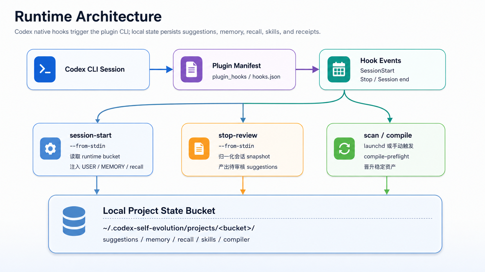
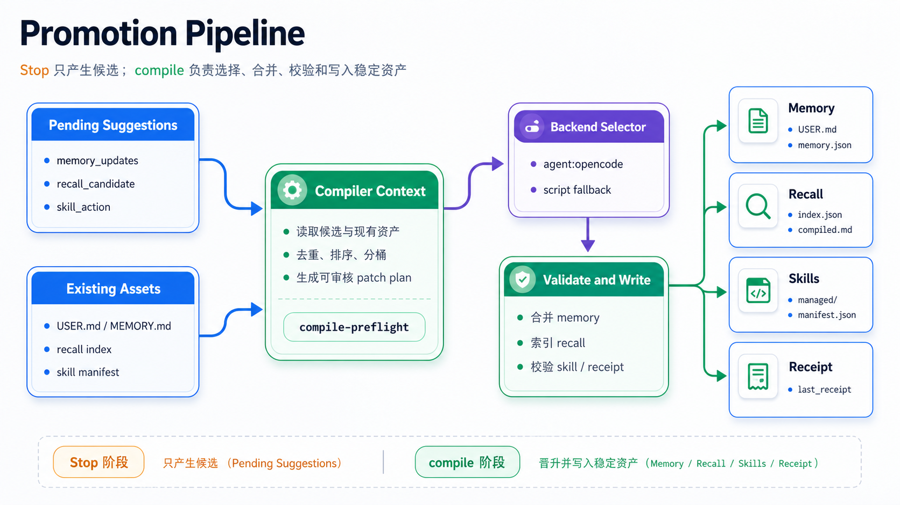
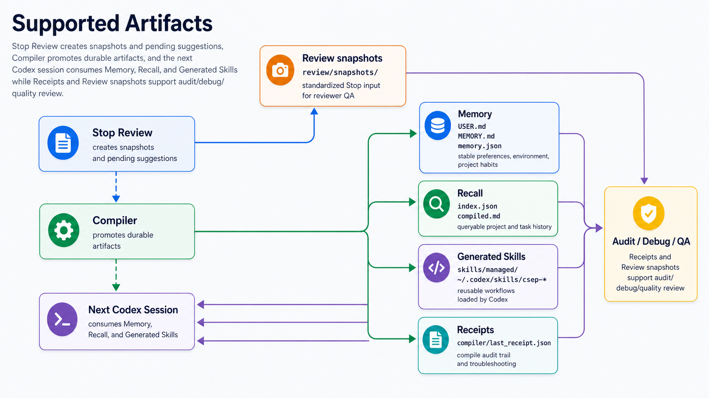
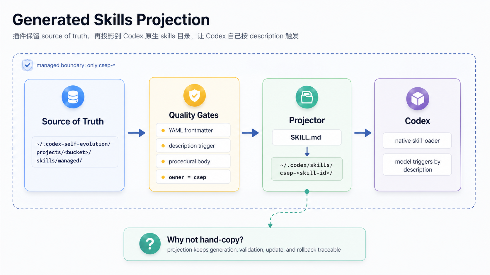

# Codex Self-Evolution Plugin

[](https://github.com/T0UGH/codex-self-evolution-plugin/actions/workflows/test.yml)
[](LICENSE)
[](https://www.python.org/)

Codex 自我进化插件 | Memory / Recall / Synthesized Skills 自动沉淀 | 面向重度 Codex 工作流



## 概述

Codex Self-Evolution Plugin 是一个本地优先的 Codex 自我进化层。

它解决的问题很直接：Codex 能完成当前任务，但默认不会把这次任务里学到的用户偏好、项目经验、排查路径和可复用流程带到下一次会话。

这个插件通过 Codex lifecycle hooks、后台 reviewer、定时 compiler、独立 skill synthesis 和标准 Codex Skills，把一次会话里的有效经验沉淀为下一次会话可以直接使用的上下文。

核心闭环：

```text
SessionStart 注入背景
  -> Codex 正常工作
  -> Stop 阶段复盘会话
  -> Compiler 晋升 memory / recall
  -> Skill Synthesis 生成 csep-synth-* skills
  -> 下一次 Codex 会话自动获得更好的上下文
```

## 推荐使用方式

| 客户端 / 运行方式 | 状态 | 说明 |
| --- | --- | --- |
| Codex CLI 最新源码版 | 已验证 | 支持 `plugins` / `codex_hooks` / `plugin_hooks` 后可原生加载插件 hooks。 |
| Codex CLI 0.125.0 | 部分可用 | 可加载生成的 skills；`plugin_hooks` feature 尚不可用，需要升级 Codex。 |
| Pi agent backends | 已接入 | compiler 默认使用 `pi --provider kimi --model kimi-k2.6` 归纳 memory / recall；skill synthesis 默认使用 `pi --provider minimax --model MiniMax-M2.7` 合成 `csep-synth-*` skills。 |
| OpenCode / opencode | 可选 | 保留为 `agent:opencode` backend，便于回退或对比。 |
| 手动 CLI | 已支持 | 不依赖 Codex hooks，可直接跑 reviewer / compile / recall 调试闭环。 |

如果你运行 Codex 时看到 `Unknown feature flag: plugin_hooks`，说明当前 Codex CLI 版本还没包含 plugin hook 支持。此时可以先使用手动 CLI 和 scheduler 路径，或更新 Codex 后再启用 plugin hooks。

## 安装

### 方式一：本地安装（推荐）

前置依赖：

```bash
brew install uv
```

安装插件 CLI，并刷新 Codex 本地 plugin cache：

```bash
git clone https://github.com/T0UGH/codex-self-evolution-plugin.git
cd codex-self-evolution-plugin

mkdir -p ~/.codex-self-evolution
cp .env.provider.example ~/.codex-self-evolution/.env.provider
# 编辑 ~/.codex-self-evolution/.env.provider，填入 MINIMAX_API_KEY / OPENAI_API_KEY / ANTHROPIC_API_KEY 中至少一个

scripts/install.sh
```

`scripts/install.sh` 会做这些事：

- 用 `uv tool install --force <当前仓库>` 安装 `codex-self-evolution` 和 `csep`
- 刷新 `~/.codex/plugins/cache/codex-self-evolution/...`
- 清理旧版 marker-managed `~/.codex/hooks.json` 注入项
- 不再向 `~/.codex/hooks.json` 注入新 hook

### 启用 Codex plugin hooks

如果你的 Codex CLI 已支持 `plugin_hooks`，在 `~/.codex/config.toml` 中启用：

```toml
[features]
plugins = true
codex_hooks = true
plugin_hooks = true

[plugins."codex-self-evolution@codex-self-evolution"]
enabled = true
```

插件 hook 定义位于：

```text
plugins/codex-self-evolution/.codex-plugin/plugin.json
plugins/codex-self-evolution/.codex-plugin/hooks.json
```

manifest 中的 hooks 路径是相对 plugin root 的：

```json
"hooks": "./.codex-plugin/hooks.json"
```

### 安装后台调度器

macOS 下可以安装 launchd 定时任务，每 5 分钟扫描所有项目 bucket 并执行 compile：

```bash
scripts/install-scheduler.sh
```

卸载：

```bash
scripts/uninstall-scheduler.sh
```

清理旧版 user-level hook：

```bash
scripts/uninstall-codex-hook.sh
```

### 安装 Skill Synthesis 调度器

Compiler 不再创建 generated skills，只负责晋升 memory 和 recall。可复用流程 skill 由独立全局命令合成：

```bash
codex-self-evolution skill-synthesize --mode full --lookback-days 30 --dry-run
codex-self-evolution skill-synthesize --mode incremental --lookback-hours 24
```

安装独立的 4 小时 launchd 任务：

```bash
scripts/install-skill-synthesis-scheduler.sh
```

Synthesized skills 只写入 `~/.codex/skills/csep-synth-*`。既有 `csep-*` compiler skills 是 legacy read-only artifacts。

## 快速开始

### 1. 检查运行状态

```bash
codex-self-evolution status | python3 -m json.tool
```

重点看：

| 字段 | 期望 |
| --- | --- |
| `plugin_hooks.manifest_exists` | `true` |
| `plugin_hooks.hooks_file_exists` | `true` |
| `plugin_hooks.session_start_declared` | `true` |
| `plugin_hooks.stop_declared` | `true` |
| `plugin_hooks.uses_local_cli` | `true` |
| `legacy_user_hooks.stop_installed` | `false` |

### 2. 用 Codex 正常工作

启用 plugin hooks 后，Codex 会在会话生命周期里自动触发：

```text
SessionStart
  -> codex-self-evolution session-start --from-stdin

Stop
  -> codex-self-evolution stop-review --from-stdin
```

Stop 阶段会生成 pending suggestions，scheduler 或手动 compile 会把它们晋升成长期资产。

### 3. 手动触发 recall

```bash
csep recall "这个仓库之前 phase2 hooks 怎么设计的"
```

`csep recall` 默认输出 Markdown，适合模型直接阅读；调试时可以用 JSON：

```bash
csep recall "focused query" --format json
```

### 4. 手动跑一次 compile

```bash
codex-self-evolution scan --backend agent:pi --max-runs-per-project 3
```

生产默认使用 `agent:pi`。Pi 默认以 `edit` 模式直接编辑临时 assets workspace，
单次 compile 只处理一条 envelope；scan 会用 `--max-runs-per-project 3` 在每个
bucket 连续 drain 几轮，避免 5 分钟定时造成积压。如需回退旧协议，可把
`[compile.pi] mode = "json"`。`agent:opencode` 和 deterministic `script` 仍可用于对比或调试。

## 工作流

完整流程分为四层：

| 层级 | 作用 | 产物 |
| --- | --- | --- |
| SessionStart | 读取稳定背景和 recall contract，注入当前会话 | `USER.md`、`MEMORY.md`、recall policy |
| Stop Review | 对本次会话做结构化复盘 | pending `SuggestionEnvelope` |
| Compile | 批量归纳并晋升建议 | memory、recall、receipt |
| Skill Synthesis | 周期性扫描历史证据并合成可复用流程 | `~/.codex/skills/csep-synth-*`、synthesis receipt |
| Next Session | 下次会话自动读取有效资产 | 更准的背景、更少重复解释 |



默认状态目录：

```text
~/.codex-self-evolution/
├── .env.provider
├── skill_synthesis/
│   ├── runs/
│   ├── receipts/
│   ├── evidence_index.json
│   └── last_receipt.json
└── projects/
    └── -Users-you-code-repo/
        ├── suggestions/{pending,processing,done,failed,discarded}/
        ├── memory/
        ├── recall/
        ├── skills/managed/        # legacy compiler skill artifacts
        ├── compiler/
        ├── review/snapshots/
        └── scheduler/
```

每个 repo 会按绝对路径分配独立 bucket，不会把运行时产物写进业务代码仓库。

## 支持的产物

| 产物 | 说明 |
| --- | --- |
| Memory | 长期稳定事实，例如用户偏好、环境约束、项目习惯。 |
| Recall | 与具体项目 / 任务相关的历史经验，用于按需召回。 |
| Generated Skills | 可复用操作流程，由 `skill-synthesize` 写入 `~/.codex/skills/csep-synth-*`，让 Codex 像普通 skill 一样加载。 |
| Receipts | compiler 执行记录，用于审计和排查。 |
| Review snapshots | Stop 阶段的标准化输入快照，用于复盘 reviewer 质量。 |



## 支持的 Reviewer Provider

| Provider | 环境变量 | 说明 |
| --- | --- | --- |
| `dummy` | 无 | 测试 / dry run。 |
| `minimax` | `MINIMAX_API_KEY` | 默认推荐的真实 reviewer provider。 |
| `openai-compatible` | `OPENAI_API_KEY` | OpenAI chat-completions 兼容协议。 |
| `anthropic-style` | `ANTHROPIC_API_KEY` | Anthropic messages 兼容协议。 |

配置文件位置：

```bash
~/.codex-self-evolution/.env.provider
```

示例：

```bash
MINIMAX_API_KEY=xxx
MINIMAX_REGION=global
MINIMAX_REVIEW_MODEL=MiniMax-M2.7
```

完整配置项见 [docs/getting-started.md](docs/getting-started.md)。

## Generated Skills

Phase 2 之后，生成好的 skill 不需要手动搬运。



Skill Synthesis 会维护独立运行状态，并把通过门禁的 skill 投影给 Codex：

| 位置 | 角色 |
| --- | --- |
| `~/.codex-self-evolution/skill_synthesis/` | 全局合成状态、候选、废弃项和 receipt。 |
| `~/.codex/skills/csep-synth-<skill-id>/SKILL.md` | 投影给 Codex 原生 skill loader 使用。 |

发布规则：

- 只有 active 且通过质量门禁的 skill 会投影
- skill 必须有有效 YAML frontmatter
- `description` 必须包含明确触发语义
- 低信号、空壳、只有事实摘要的候选不会发布
- 只会修改 `csep-synth-` 前缀下的托管目录，不碰用户自己写的 skills

## CLI 命令

| 命令 | 说明 |
| --- | --- |
| `codex-self-evolution session-start --from-stdin` | Codex SessionStart hook 入口。 |
| `codex-self-evolution stop-review --from-stdin` | Codex Stop hook 入口。 |
| `codex-self-evolution compile-preflight` | 检查是否需要 compile，处理空队列 / 锁 / stale lock。 |
| `codex-self-evolution compile --once` | 单次 compile。 |
| `codex-self-evolution scan --backend agent:pi --max-runs-per-project 3` | 扫描所有项目 bucket，并在每个 bucket 内最多连续编译 3 轮 pending suggestions。 |
| `codex-self-evolution eval-compiler --fixture tests/fixtures/compiler_replay/commerce_membership_api.json` | 回放编译质量样本，输出 pass/fail 和 memory/recall/discard 指标。 |
| `codex-self-evolution recall-trigger --query "..."` | 触发一次聚焦 recall。 |
| `codex-self-evolution status` | 输出只读诊断快照。 |
| `csep recall "..."` | 面向模型使用的 recall wrapper。 |

常用示例：

```bash
codex-self-evolution status | python3 -m json.tool
codex-self-evolution scan --backend agent:pi --max-runs-per-project 3
csep recall "这个 repo 的上线检查流程"
```

## 配置优先级

| 类型 | 位置 / 来源 | 说明 |
| --- | --- | --- |
| Provider key | `~/.codex-self-evolution/.env.provider` | 推荐放这里，hook / scheduler / 手动命令共用。 |
| Runtime home | `CODEX_SELF_EVOLUTION_HOME` | 默认 `~/.codex-self-evolution`。 |
| Codex plugin | `~/.codex/config.toml` + `~/.codex/plugins/cache/` | Codex 自己读取。 |
| Compiler backend | `--backend` / `CODEX_SELF_EVOLUTION_PI_*` | 控制 `script`、`agent:pi` 或 `agent:opencode`；`CODEX_SELF_EVOLUTION_PI_MODE=json` 可切回旧 JSON 回传。 |
| Per-command state | `--state-dir` | 调试时可指定临时目录。 |

## 开发

```bash
# 创建本地开发环境
python3 -m venv .venv
.venv/bin/pip install -e '.[dev]'

# 跑测试
.venv/bin/python -m pytest -q

# 本地 E2E
make e2e-local

# provider smoke test
make provider-smoke-minimax
```

Docker E2E：

```bash
docker build -t codex-self-evolution-e2e .
docker run --rm codex-self-evolution-e2e
```

## 发布新版本

```bash
# 1. 修改 pyproject.toml 版本号
$EDITOR pyproject.toml

# 2. 跑测试
.venv/bin/python -m pytest -q

# 3. 构建
uvx --from build pyproject-build

# 4. 上传 PyPI
uvx twine upload dist/*
```

## 当前状态

已经可用：

- Codex-first `SessionStart` / `Stop` 生命周期接入
- provider-backed reviewer
- per-repo runtime bucket
- memory / recall 晋升
- independent skill synthesis 自动投影到 `~/.codex/skills/csep-synth-*`
- launchd scheduler
- `agent:pi` compiler backend，默认 `kimi/kimi-k2.6` + direct-edit workspace
- `agent:pi` skill synthesis backend，默认 `minimax/MiniMax-M2.7`

仍在演进：

- first-run onboarding
- promotion 质量评估
- Codex CLI plugin hooks 的正式发布版本兼容
- Claude Code / Cursor 等其他客户端适配
- 多用户 / 团队级治理

## 文档

| 文档 | 内容 |
| --- | --- |
| [docs/getting-started.md](docs/getting-started.md) | 分阶段安装、手动闭环、排障。 |
| [docs/2026-04-30-memory-skill-recall-runtime-audit.md](docs/2026-04-30-memory-skill-recall-runtime-audit.md) | memory / skill / recall 质量审计。 |
| [docs/implementation-plans/2026-04-30-phase2-plugin-hooks-and-generated-skills-plan.md](docs/implementation-plans/2026-04-30-phase2-plugin-hooks-and-generated-skills-plan.md) | Phase 2 设计与实现计划。 |
| [docs/2026-04-20-compiler-existing-assets-handoff.md](docs/2026-04-20-compiler-existing-assets-handoff.md) | compiler existing-assets 交接说明。 |

## License

MIT
