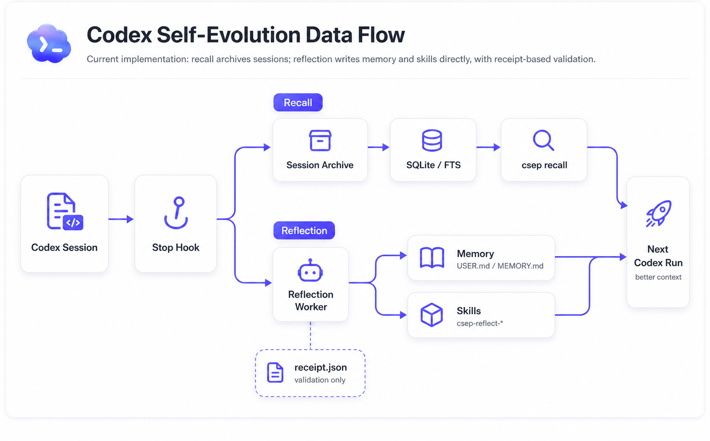

# Codex Self-Evolution Plugin

[](https://github.com/T0UGH/codex-self-evolution-plugin/actions/workflows/test.yml)
[](LICENSE)
[](https://www.python.org/)

中文 | [English](README_en.md)

让 Codex 把每次协作变成下一次的进步。

> 用 Codex 5.3 Spark 的空闲额度，帮你的 Codex 在后台攒经验。

如果你一天开好几个 Codex session，很快会发现一个很烦的问题：它这次能把活干完，但下次还是像第一次进仓库一样。测试命令要重讲，项目边界要重讲，你刚纠正过的写法和偏好也要重讲。

当然可以自己搭一套 harness，把 prompt、脚本、知识库和日志都管起来。只是这件事太费劲了。`csep` 不要求你自己维护一整套外部流程，它直接接进 Codex 的生命周期，让 Codex 在真实使用里慢慢攒经验。

Codex Self-Evolution Plugin，简称 `csep`。它在 `SessionStart` 时把稳定背景注入 Codex 上下文；在 `Stop` 时归档 transcript；遇到值得沉淀的 session，再开一个后台 reflection worker，把经验写成 memory 或 `csep-reflect-*` skill。历史 session 会进本地 SQLite/FTS，之后可以用 `csep recall` 找回来。

它不是聊天记录备份工具。备份只能让你回看过去；`csep` 更关心下一次 Codex 能不能少问两句，少猜一点，少重复犯同一个错。



图里只有三条线：`SessionStart` 读 memory，`Stop` 归档 session，触发后再由 reflection worker 写 memory 和 skill。

## 为什么需要它

用了几天 Codex 后，真正消耗人的往往不是大问题，而是这些重复的小事：

- 这个仓库该怎么跑测试。
- 这个用户不喜欢什么风格。
- 哪些文件不能碰。
- 上次已经验证过什么方案。
- 某类任务应该用哪个工具、哪条命令。
- 哪些纠正值得变成长期规则或 skill。

`csep` 把这些经验留在本机。下次 Codex session 开始时，它们会先进入上下文；需要查旧 session 时，再用 `csep recall` 翻出来。

## 它做什么

| 能力 | 写入时机 | 下一次如何使用 |
| --- | --- | --- |
| Stable Memory | 达到 trigger 条件后，由 session reflection 写入 `MEMORY.md` / `memory/refs/` | `SessionStart` 自动注入 `MEMORY.md` |
| Session Recall | `Stop` hook 把 transcript 归档到本地 SQLite/FTS；插件内置 `csep-session-recall` skill 教 Codex 如何检索 | `csep recall "needle1|needle2"` 像 `rg` 一样按当前 repo 或全局检索历史证据 |
| Reflection Skills | reflection worker 写入 `~/.codex/skills/csep-reflect-*` | Codex 原生 skills loader 自动加载 |
| Runtime Status | hooks、配置、日志、reflection job、recall DB 都可只读检查 | `csep status` 排查当前运行状态 |

每次 `Stop` 都会归档 session，但 reflection 只在计数或高信号命中后运行。

## 设计原则

- 状态默认放在 `~/.codex-self-evolution/`，不写进业务仓库。
- `SessionStart` / `Stop` hook 失败时尽量放行，不拖垮 Codex 正常工作。
- 每次 `Stop` 都会归档 session，但 reflection 不是每次都跑；只有计数或高信号命中后才 fork worker。
- reflection worker 写完必须留下 `receipt.json`，父进程会校验路径、hash 和 skill 命名空间。
- memory 写在当前 repo bucket；生成 skill 只允许落到 `csep-reflect-*`，不碰用户已有 skill。
- 核心包只用 Python stdlib，尽量减少安装、升级和 hook 执行时的变量。

## 安装和启用

需要本机已经有 Codex CLI，并且 Codex 支持 `plugins` / `hooks` / `plugin_hooks`。

推荐路径：

```bash
uvx csep setup
```

这条命令会安装 `csep` CLI，把本仓库注册为 Codex plugin marketplace，并打开 `~/.codex/config.toml` 里的插件开关。装完后新开一个 Codex session，插件就会跟着生命周期 hook 运行。

没有 `uv` 的话，先装 `uv`，再跑同一条 setup：

```bash
brew install uv
uvx csep setup
```

也可以直接跑安装脚本：

```bash
curl -fsSL https://raw.githubusercontent.com/T0UGH/codex-self-evolution-plugin/main/scripts/setup.sh | bash
```

检查当前状态：

```bash
csep status | python3 -m json.tool
```

重点看 `plugin_hooks.manifest_exists`、`plugin_hooks.session_start_declared`、`plugin_hooks.stop_declared` 是否为 `true`。之后每次 `SessionStart` 会注入 memory，每次 `Stop` 会归档 transcript；reflection 只在触发条件满足时后台运行。

### 首次回填历史

`Stop` hook 会自动归档以后发生的 Codex session；如果是新安装，而本机已经有 `~/.codex/sessions` 历史对话，先做一次 bootstrap，避免第一次 `csep recall` 搜不到旧上下文：

```bash
csep recall bootstrap --since-days 30
```

它会按 transcript 修改时间从新到旧导入，并输出 `new_sessions`、`updated_sessions`、`unchanged_sessions` 和 `error_count`。需要回填全部历史时：

```bash
csep recall bootstrap --all-history
```

如果你还想把 Claude Code 的本地历史也放进同一个 recall 数据库，可以同步 `~/.claude/projects`：

```bash
csep recall sync-claude --since-days 30
```

想确认 recall 已经有数据，可以跑：

```bash
csep recall --recent
```

安装、验证和排障细节见 [docs/getting-started.md](docs/getting-started.md)。

## 常用命令

日常使用基本只会碰到这几条：

| 命令 | 用途 |
| --- | --- |
| `csep setup` | 安装 CLI、注册 Codex plugin marketplace、启用 plugin hooks |
| `csep status` | 看插件、hook、reflection、recall 当前是否正常 |
| `csep config path` / `show` / `validate` | 查看配置路径、当前配置和校验结果 |
| `csep recall "needle1|needle2"` | 像 `rg` 一样在当前 repo 的历史 session 里找上下文 |
| `csep recall --recent` | 看当前 repo 最近归档了哪些 session |
| `csep recall bootstrap` | 把本机历史 Codex sessions 回填进 recall 数据库 |
| `csep recall sync-claude` | 把本机 Claude Code 历史 sessions 同步进 recall 数据库 |
| `csep session-reflect --status` | reflection 没按预期运行时再看 |

`csep recall` 不是问答接口，推荐搜索文件名、命令、错误文本、代码符号或用户原话这类短 needle；需要跨 repo 时再显式加 `--global`。

`session-start`、`session-stop`、`session-archive`、`session-ingest` 主要给 hook 和底层排障使用。完整列表见 [docs/getting-started.md](docs/getting-started.md)。

## 性能和运行方式

`SessionStart` / `Stop` 前台只做轻量文件读写、归档触发和状态判断；模型 reflection 在后台运行，不阻塞 Codex 正常退出。

这台机器 2026-05-15 的本地日志里，最近 100 次以内的前台 hook 大致是这个量级：

| 路径 | median | p95 |
| --- | --- | --- |
| `session-start` | 26ms | 51ms |
| `session-stop` | 15ms | 33ms |

`session-reflect` 是后台模型任务，耗时通常按几十秒到几分钟看，不在 Codex Stop 前台等待。

## 运行时目录

默认状态目录：

```text
~/.codex-self-evolution/
├── .env.provider
├── config.toml
├── logs/
├── session_reflection/
│   ├── jobs/
│   ├── runs/
│   ├── child_threads/
│   ├── triggers/
│   ├── locks/
│   └── latest.json
├── session_recall/
│   └── state.db
└── projects/
    └── -Users-you-code-repo/
        └── memory/
            ├── MEMORY.md
            └── refs/
                └── ...
```

每个 repo 会按绝对路径分配独立 bucket。`MEMORY.md` 是唯一默认注入的热上下文；`refs/` 保存按需读取的长资料，不会在 `SessionStart` 自动展开。旧 `USER.md` 如果存在会保留在磁盘上，但新版本只在 `status` 中提示 ignored。

## 安全边界

`csep` 会让后台 reflection worker 读取当前 session，并写入本机文件。这里的边界要说清楚：

- provider secret 不进仓库，密钥放在 `~/.codex-self-evolution/.env.provider`。
- runtime state 不写进业务仓库。
- `csep-reflect-*` 之外的 skill 不会被当作有效产物。
- memory 写入只接受当前 repo bucket 下的 `MEMORY.md` 和 `memory/refs/**/*.md`。
- child thread 的口头声明不算数，父进程只认 `receipt.json` 和校验结果。
- hook 前台不做长耗时工作，避免影响 Codex 正常退出。

## 边界 / 不做什么

- 不是云端记忆服务。
- 不是团队知识库。
- 不是通用 agent framework。
- 不是旧的 reviewer / compiler / scheduler pipeline。

它只做一件事：让你本机上的 Codex session 形成可验证、可召回、能继续积累的学习闭环。

## 当前状态

能用的部分：

- Codex 启动时自动注入历史背景。
- Codex 停止时自动归档当前 session。
- 达到触发条件后，后台 reflection 会评估是否写入 memory 或 skill。
- memory 写入有 `receipt.json` 和父进程边界校验。
- 生成 skill 只允许使用 `csep-reflect-*` 前缀。
- `csep recall` 可以查回当前 repo 的历史 session。
- 同一仓库的多个 worktree 会尽量共享同一份 repo 记忆。
- `csep status` / `csep config` 提供只读排障入口。

还在打磨：

- first-run onboarding
- reflection 质量评估
- README 图示和演示素材
- Claude Code / Cursor 等其他客户端适配

## 开发

```bash
python3 -m venv .venv
.venv/bin/pip install -e '.[dev]'
.venv/bin/python -m pytest -q
```

也可以使用当前仓库的 `uv` 环境：

```bash
uv run pytest -q
uv run python -m build
uv run twine check dist/*
```

## 文档

| 文档 | 内容 |
| --- | --- |
| [docs/getting-started.md](docs/getting-started.md) | 本机安装、启用、验证和排障 |
| [docs/architecture.md](docs/architecture.md) | 当前 Memory / Reflection Skills / Session Recall 总架构 |
| [docs/session-reflection.md](docs/session-reflection.md) | session reflection worker、trigger policy 和写入边界 |
| [docs/session-recall.md](docs/session-recall.md) | SQLite/FTS session recall 的写入、检索和边界 |

## License

MIT
